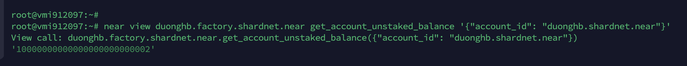

# Stake Wars: Episode III. Challenge 003
* Published on: 
* Updated on: 
* Submitted by: DuongHB

Deploy a new staking pool for your validator. Do operations on your staking pool to delegate and stake NEAR.


## Useful links

Wallet: https://wallet.shardnet.near.org/

Explorer: https://explorer.shardnet.near.org/ 


## 3. Mounting a staking pool

NEAR uses a staking pool factory with a whitelisted staking contract to ensure delegators’ funds are safe. In order to run a validator on NEAR, a staking pool must be deployed to a NEAR account and integrated into a NEAR validator node. Delegators must use a UI or the command line to stake to the pool. A staking pool is a smart contract that is deployed to a NEAR account.

#### Deploy a Staking Pool Contract
##### Deploy a Staking Pool
Calls the staking pool factory, creates a new staking pool with the specified name, and deploys it to the indicated accountId.

```
near call factory.shardnet.near create_staking_pool '{"staking_pool_id": "duonghb", "owner_id": "duonghb.shardnet.near", "stake_public_key": "ed25519:8VdKQhN23QT6mvrBsjyY9YcBWfZM9NcksVqrXNui56nE", "reward_fee_fraction": {"numerator": 5, "denominator": 100}, "code_hash":"DD428g9eqLL8fWUxv8QSpVFzyHi1Qd16P8ephYCTmMSZ"}' --accountId="duonghb.shardnet.near" --amount=30 --gas=300000000000000
```

From the example above, you need to replace:

* **Pool ID**: Staking pool name, the factory automatically adds its name to this parameter, creating {pool_id}.{staking_pool_factory}
Examples:   

- If pool id is `duonghb` will create : `duonghb.factory.shardnet.near`

* **Owner ID**: The SHARDNET account (i.e. duonghb.shardnet.near) that will manage the staking pool.
* **Public Key**: The public key in your **validator_key.json** file.
* **5**: The fee the pool will charge (e.g. in this case 5 over 100 is 5% of fees).
* **Account Id**: The SHARDNET account deploying and signing the mount tx.  Usually the same as the Owner ID.

> Be sure to have at least 30 NEAR available, it is the minimum required for storage.
Example : near call duonghb.factory.shardnet.near --amount 30 --accountId duonghb.shardnet.near --gas=300000000000000


To change the pool parameters, such as changing the amount of commission charged to 1% in the example below, use this command:
```
near call duonghb.factory.shardnet.near update_reward_fee_fraction '{"reward_fee_fraction": {"numerator": 3, "denominator": 100}}' --accountId duonghb.shardnet.near --gas=300000000000000
```


You will see something like this:


If there is a “True” at the End. Your pool is created.

**You have now configure your Staking pool.**

Check your pool is now visible on https://explorer.shardnet.near.org/nodes/validators


#### Transactions Guide
##### Deposit and Stake NEAR

Command: Staking 100 Near from `duonghb.shardnet.near` to pool_id `duonghb.factory.shardnet.near`
```
near call duonghb.factory.shardnet.near deposit_and_stake --amount 30 --accountId duonghb.shardnet.near --gas=300000000000000
```
##### Unstake NEAR
Amount in yoctoNEAR.

Run the following command to unstake:
```
near call duonghb.factory.shardnet.near unstake '{"amount": "10000000000000000000000000"}' --accountId duonghb.shardnet.near --gas=300000000000000
```

To unstake all you can run this one:
```
near call duonghb.factory.shardnet.near unstake_all --accountId duonghb.shardnet.near --gas=300000000000000
```

##### Withdraw

Unstaking takes 2-3 epochs to complete, after that period you can withdraw in YoctoNEAR from pool.

Command:
```
near call duonghb.factory.shardnet.near withdraw '{"amount": "100000000000000000000000000"}' --accountId duonghb.shardnet.near --gas=300000000000000
```
Command to withdraw all:
```
near call duonghb.factory.shardnet.near withdraw_all --accountId duonghb.shardnet.near --gas=300000000000000
```

##### Ping
A ping issues a new proposal and updates the staking balances for your delegators. A ping should be issued each epoch to keep reported rewards current.

Command:
```
near call duonghb.factory.shardnet.near ping '{}' --accountId duonghb.shardnet.near --gas=300000000000000
```
Balances
Total Balance
Command:
```
near view duonghb.factory.shardnet.near get_account_total_balance '{"account_id": "duonghb.shardnet.near"}'
```
##### Staked Balance
Command:
```
near view duonghb.factory.shardnet.near get_account_staked_balance '{"account_id": "duonghb.shardnet.near"}'
```

##### Unstaked Balance
Command:
```
near view duonghb.factory.shardnet.near get_account_unstaked_balance '{"account_id": "duonghb.shardnet.near"}'
```

##### Available for Withdrawal
You can only withdraw funds from a contract if they are unlocked.

Command:
```
near view duonghb.factory.shardnet.near is_account_unstaked_balance_available '{"account_id": "duonghb.shardnet.near"}'
```
##### Pause / Resume Staking
###### Pause
Command:
```
near call duonghb.factory.shardnet.near pause_staking '{}' --accountId duonghb.shardnet.near
```
###### Resume
Command:
```
near call duonghb.factory.shardnet.near resume_staking '{}' --accountId duonghb.shardnet.near
```

## Let's go to challenge 4 🚀

[Check your Node](./004.md).

## Update log

Updated 2022-07-22: Creation
