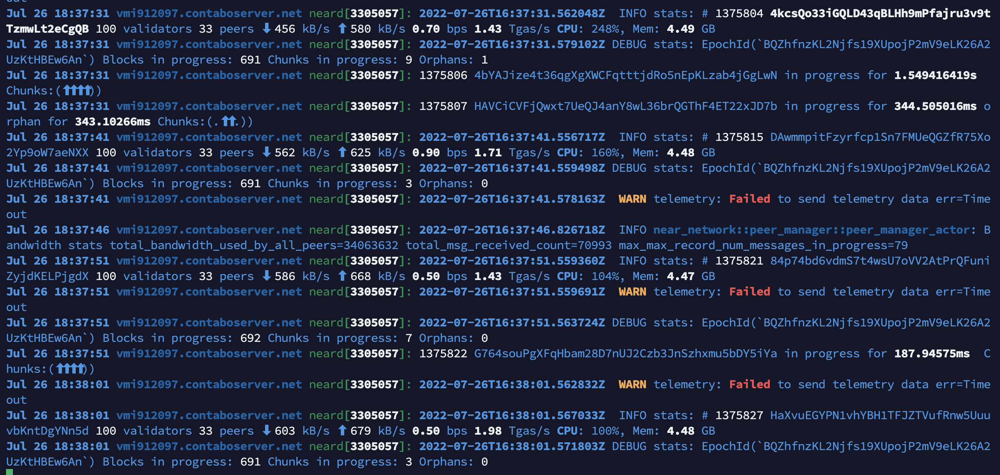
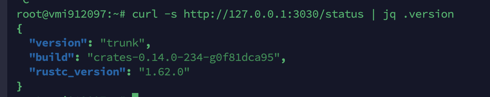
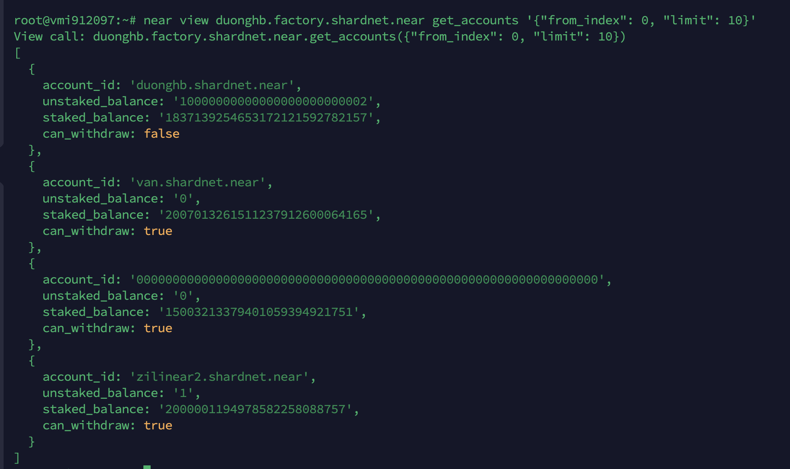
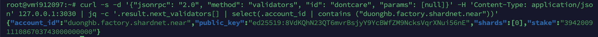

# Stake Wars: Episode III. Challenge 004
* Published on: 
* Updated on: 
* Submitted by: DuongHB

Setup tools for monitoring node status. Install and use RPC on port 3030 to get useful information for keep your node working.


## Usefull links

Wallet: https://wallet.shardnet.near.org/

Explorer: https://explorer.shardnet.near.org/ 


### Monitor and make alerts 

An email notification can make it more comfortable to maintain a validator up and running. Achieve to be a validator confirming transactions on testnet and get >95% of uptime.

#### Log Files
The log file is stored either in the ~/.nearup/logs directory or in systemd depending on your setup.


Systemd Command:
```
journalctl -n 100 -f -u neard | ccze -A
```

**Log file sample:**

Validator | 100 validators



* **Validator**: A “Validator” will indicate you are an active validator
* **100 validators**: Total 100 validators on the network
* **33 peers**: You current have 33 peers. You need at least 3 peers to reach consensus and start validating
* **#1375806**: block – Look to ensure blocks are moving

#### RPC
Any node within the network offers RPC services on port 3030 as long as the port is open in the nodes firewall. The NEAR-CLI uses RPC calls behind the scenes. Common uses for RPC are to check on validator stats, node version and to see delegator stake, although it can be used to interact with the blockchain, accounts and contracts overall.

Find many commands and how to use them in more detail here:

https://docs.near.org/docs/api/rpc


Command:
```
sudo apt install curl jq
```
###### Common Commands:
####### Check your node version:
Command:
```
curl -s http://127.0.0.1:3030/status | jq .version
```

####### Check Delegators and Stake
Command:
```
near view duonghb.factory.shardnet.near get_accounts '{"from_index": 0, "limit": 10}'
```

####### Check Reason Validator Kicked
Command:
```
curl -s -d '{"jsonrpc": "2.0", "method": "validators", "id": "dontcare", "params": [null]}' -H 'Content-Type: application/json' 127.0.0.1:3030 | jq -c '.result.prev_epoch_kickout[] | select(.account_id | contains ("duonghb.factory.shardnet.near"))' | jq .reason
```
####### Check Blocks Produced / Expected
Command:Check next validators
```
curl -s -d '{"jsonrpc": "2.0", "method": "validators", "id": "dontcare", "params": [null]}' -H 'Content-Type: application/json' 127.0.0.1:3030 | jq -c '.result.next_validators[] | select(.account_id | contains ("duonghb.factory.shardnet.near"))'
```

## Let's go to challenge 5 🚀

[Run on multiple cloud providers](./005.md).

## Update log

Updated 2022-07-22: Creation
